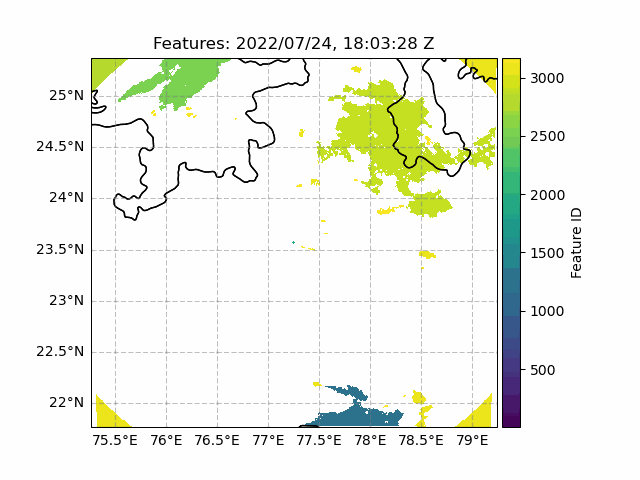
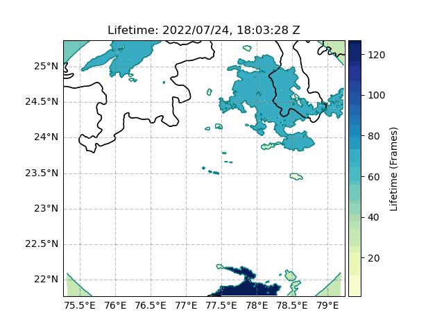

# Simple-Track

<p align="center">


</p>

Simple-Track is a data-agnostic, threshold-based feature tracking algorithm for 2D data. 

Features are tracked between consecutive frames of data by projecting feature fields onto common timeframes and matching between them based on the degree of overlap. Matched features retain the same identification between all tracked fields, while new features are assigned a unique label. Comprehensive information about feature merging, splitting, accretion, initiation and dissipation is compiled using Simple-Track. 

# Installation

Coming soon to PyPi and conda-forge

# User Guide

## Input Requirements
While Simple-Track is designed to accept a wide range of input data, certain requirements must be met for the tool to function as intended:

* The input data must be gridded and contain a consistent spatial domain and resolution between frames.

* The features of interest must be defined by a threshold value, and these features must translate as a result of a spatially consistent background flow.

* The time between frames should be sufficiently short such that features can be reasonably expected to persist between frames. This is not a strict requirement since the tool includes an artificial advection step that projects data onto a common time, but it is likely that longer time steps will lead to more errors in feature matching and therefore less accurate tracking statistics. 

* It is currently a requirement that the timestep between frames is fixed, although future updates may relax this requirement. 

## Running Simple-Track

Simple-Track can be run in two ways:

### 1. Running Simple-Track from the Command Line
* Simple-Track can be run from the command line with a config file as an additional argument:

	```
	python3 run_simple_track.py my_config.yaml 
	```

* The `my_config.yaml` file contains the parameters for running Simple-Track. The necessary parameters for running Simple-Track from the command line are shown below:

	```yaml
	INPUT:
		path: /path_to_folder_containing_data
		loader: LoaderName # See next section
	FEATURE:
		threshold: 1 # Threshold used for defining a feature
		under_threshold: false # Whether features are defined above or below the threshold
	```
	
* Other parameters, such as `experiment_name`, `output_path` and `save_data`, along with more technical options, can also be set in this config file. See [All Simple-Track Parameters](#all-simple-track-parameters) for a full list.

* A valid `Loader` object is required for pre-processing input data before tracking. See [Loading Data](#loading-data) for more information.

* Any number of config files can be provided as additional arguments, Simple-Track will iterate over each one in turn.

### 2. Importing Simple-Track to a python file
* Simple-Track can be run by importing the `Tracker` class from `track.py` or directly from the `simpletrack` module. The config can be input either using a path to a yaml file, or by passing a dict when instantiating the object:

	```python
	from simpletrack import Tracker

	my_config = {
		INPUT: {
			path: "/path_to_folder_containing_data",
			loader: "LoaderName" # See next section
		},
		FEATURE: {
			threshold: 1, # Threshold used for defining a feature
			under_threshold: False # Whether features are defined above or below the threshold
		}
	}

	timeline = Tracker(my_config).run()

	# Alternatively, if these parameters are saved in a config file, the path to this config can also be set as input
	timeline = Tracker("./my_config.yaml").run()
	```
* Other parameters, such as `experiment_name`, `output_path` and `save_data`, along with more technical options, can also be set in this config. See [All Simple-Track Parameters](#all-simple-track-parameters) for a full list.

* If `loader` is included as a config input, a valid `Loader` object is used for pre-processing input data before tracking. Alternatively, valid pre-processed data may be passed to the `Tracker.run()` method, bypassing the use of the `Loader` class, and eliminating the need for the `INPUT` config section. See [Loading Data](#loading-data) for more information.

* `Tracker.run()` returns a `Timeline` object which is used to store all tracking and feature data. This can be inspected and analysed beyond the [outputs](#outputs) that are saved as part of standard operation.

## Loading Data

For Simple-Track to operate effectively, each input must consist of two sets of data:

1. A `datetime` object specifying the time that the data is valid for
2. A `numpy.array` object containing the data to track

There are two methods of providing these data pairs to Simple-Track:

### 1. Using a Loader object
* Since Simple-Track is a data-agnostic tool, there may be any number of bespoke tools for loading and pre-processing data before it is suitable for tracking. This functionality can be contained in a custom `Loader` class that will perform these actions before passing the compatible data (and time) to the main processing methods.

* A custom `Loader` object should be defined in the `load.py` file and should inherit from the `BaseLoader` object, which 
will perform additional checks to ensure the loaded data is in the correct format. An example of a loader class is shown in the code snippet below:

	```python
	class ChilboltonLoader(BaseLoader):
		def __init__(self):
			super().__init__()

		def user_definable_load(self, filename):
			import iris # Import any required libraries here

			# Get 2D data from input file as a numpy array
			cube = iris.load_cube(filename, "precipitation_flux")
			data = cube.data

			# Additional data pre-processing can be performed here too!

			# Get time from input file, in datetime format
			tcoord = cube.coord("time")
			time = tcoord.units.num2pydate(tcoord.points)[0]

			# Method must return a tuple of 
			# (datetime.datetime, numpy.NDArray, ), where the 
			# first element is the time the data is valid for
			# and second element is the 2D array of data to be tracked
			return time, data
	```

* This loader class must then be added to the `available_loaders` dict in the `get_loader` function of `load.py`, where the key for this loader is used to specify the loader in the config file. This structure allows users to easily define their own loading procedures for their specific datasets, while still being able to use the core functionality of Simple-Track without modification.

* A Loader object can be used whether Simple-Track is being run [from the command line](#1-running-simple-track-from-the-command-line) or [from a python file](#2-importing-simple-track-to-a-python-file). 

* The list of filenames which will be iteratively loaded using a custom `Loader` object can be obtained and input in multiple ways:
	* If running Simple-Track [from the command line](#1-running-simple-track-from-the-command-line), the code will find all files in the config `[INPUT][path]` directory matching a given extension defined in `Tracker.get_filenames_from_input_path()`
	* If running Simple-Track [from a python file](#2-importing-simple-track-to-a-python-file), a list of filenames can be passed to `Tracker.run()`. Alternatively, if no filenames are passed to this method, the code will find all files in the config `[INPUT][path]` directory matching a given extension defined in `Tracker.get_filenames_from_input_path()`

### 2. Passing a dict directly to Tracker.run()
* If SimpleTrack is being run [from a python file](#2-importing-simple-track-to-a-python-file) and a suitable set of data has already been loaded, this data can be passed directly to `Tracker.run()` as a `dict`, with the `datetime` object as the key and a `numpy.array` object as the value

* Any number of time:data pairs can be passed to `Tracker.run()` and the code will iterate over the ordered dict.

* Passing data into `Tracker.run()` via this method will bypass any `Loader` or `[INPUT][path]` inputs specified in the corresponding config file. 


# Outputs

For each frame of data, Simple-Track compiles a set of fields and tracked feature properties. Each 2D field is of the same shape as the input fields, and contains an overview of feature properties across the space. 

Fields (`.field` files):
* Feature field: 2D array of positive integers showing unique feature id present at each location (zero indicating no feature present)
* Lifetime field: 2D array of positive integers showing lifetime of the feature present at each location (zero indicating no feature present)
* x-flow, y-flow: 2D array of floats containing the x- and y-components of the motion vectors at each location that translate features from the previous frame to the current frame

Features (`.csv` or `.txt` files):
* ID: Unique feature identifier that persists between frames (i.e., a feature retains the same id across all frames that it is tracked).
* Centroid: (y, x) tuple containing central location of feature.
* Size: Number of pixels spanned by the feature.
* dydx: (dy, dx) tuple containing motion vector that translated feature to its location in the current frame from the previous frame.
* extreme: Maximum value contained within the feature in the input data.
* lifetime: Number of timesteps the feature has existed for.
* accreted: List of IDs of features that were accreted by this feature, if applicable.
* parent: ID of parent feature that this feature split from, if applicable
* children: List of IDs of features that split from this feature, if applicable

It it also possible to perform further analysis of tracking statistics using the data structures and tools of Simple-Track. This can be done using the `Timeline` object returned by `Tracker.run()`, which contains `Frame` and `Feature` data and built-in methods for easily accessing relevant data. 

Alternatively, the data that is output by Simple-Track can be read back in to a `Timeline` object using the `LoadOutput` class in `frame_output.py`. This object only requires a path to the stored Simple-Track data. The `LoadOutput.load_to_timeline()` method will return a `Timeline` object containing all of the loaded data in the same data structures that Simple-Track stores its data. (Note: this does not currently load the raw input data back into the system, and therefore some methods such as `Frame.identify_features()` will not work. This data can be added manually to the `Frame.raw_field` attribute). 

# All Simple-Track Parameters
A complete list of parameters and their default values are given below:

```yaml
INPUT:
  path: ./path_to_input_data
  loader: MyLoader # Custom loader class name
  file_type: .nc # File extension to search for when compiling files to load and iterate over

OUTPUT:
  path: ./output
  experiment_name: Simple-Track Experiment # Name of experiment to add to output files 
  save_data: true # Whether to save data to output

FEATURE:
  threshold: 1 # Threshold used for defining a feature
  under_threshold: false # Whether features are defined above or below the threshold
  min_size: 4 # Minimum size of feature to be tracked (in pixels)

FLOW_SOLVER:
  overlap_threshold: 0.6 # Minimum fraction of overlap between features for use in flow_solver
  subdomain_size: 100 # Size in pixels of individual squares to run fft for (dy, dx) displacement. Must divide (y,x) lengths of the array. Defaults to domain size / 5
  min_fractional_coverage: 0.01  # Minimum fractional cover of objects required for fft to obtain (dy, dx) displacement
  subdomain_tolerance: 3.0  # Maximum difference in displacement values between adjacent squares (to remove spurious values)
  apply_tukey_filtering: True # Apply a 2D Tukey window to each subdomain before phase cross-correlation

TRACKING:
  skip_tracking: false # Whether to skip tracking and just output feature properties
  overlap_nbhood: 5 # Radius of halo in pixels for orphan storms - big halo assumes storms may spawn "children" at a distance multiple pixels away
  overlap_threshold: 0.6 # Minimum fraction of overlap 
  retain_lifetime_on_split: True # If a child Feature splits from its parent feature, this determines whether the child Feature should carry over the lifetime from the parent or whether its lifetime should be set to 1
```
