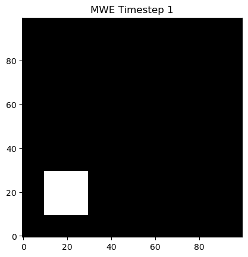
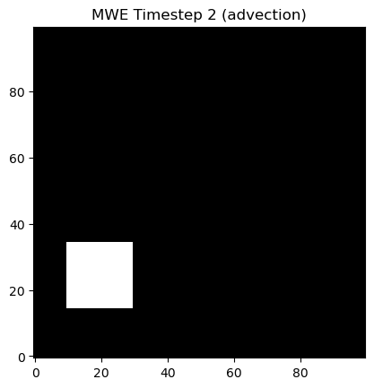
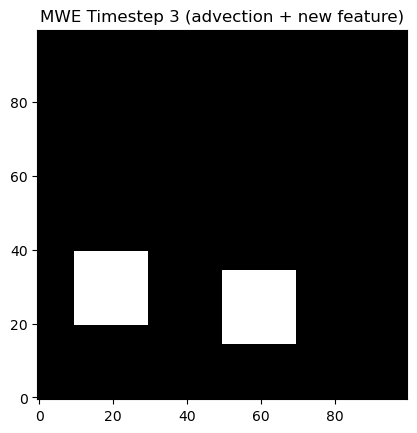
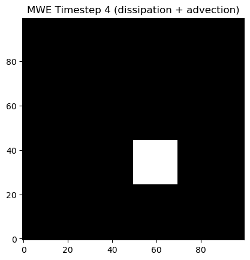
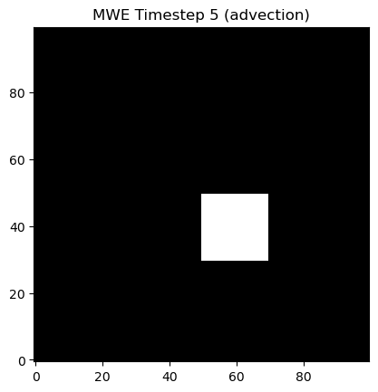
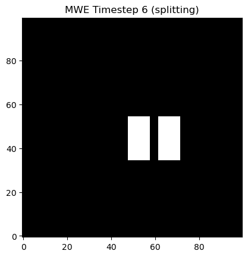
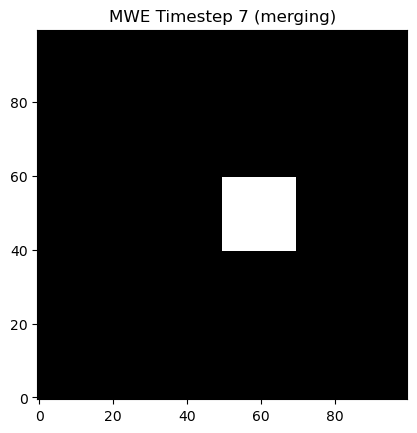
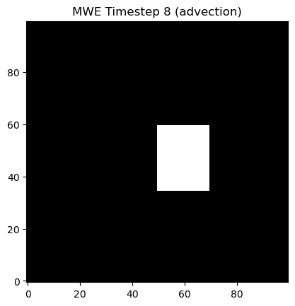

# Minimal Working Example


<p align="center">








</p>

The above images show a minimal working example used to test the full Simple-Track workflow. These fields are generated in `tests/test_mwe_output.py` using the `generate_mwe_files` function. 

The rest of this functions in this file use these fields to test that the core Simple-Track functionality is working as intended. Here, we will go through each step involved in setting up and running the tracking using a python script. These steps are performed in the `mwe_timeline` function in this file.

First, the fields are generated using the `generate_mwe_files` function:

```python
>>> mwe_fields = generate_mwe_files()
```

Next, the tracking config is defined: Since the MWE is setup using binary fields (white pixels are 1, black background pixels are 0), we will use a threshold of 0.5. The `under_threshold` option does not need to be set to `False` here since this is the default value, but this is useful for clarity. Additionally, the options in the `FLOW_SOLVER` category are also default values (the subdomain size defaults to the domain_size/5). For `TRACKING`, we are specifying that a circular radius of 5 pixels is added to the feature mask if a sufficient overlap of 0.3 is not found just using the feature location itself as a mask. 

```python
mwe_config = {
    "FEATURE": {
        "threshold": 0.5,
        "under_threshold": False,
    },
    "FLOW_SOLVER": {
        "overlap_threshold": 0.3,
        "subdomain_size": 20,
    },
    "TRACKING": {
        "overlap_nbhood": 5, 
        "overlap_threshold": 0.3
    },
}
```

Next, we construct the data dictionary that will be passed to `Tracker.run()`. Since this is just an example, we will choose a start time of midnight on January 1 2024 and increment each timestep by 5 minutes

```python
base_time = dt.datetime(2024, 1, 1, 0, 0, 0)
mwe_dict = {
    base_time + dt.timedelta(minutes=5 * int(mwe_idx)): mwe_data
    for mwe_idx, mwe_data in enumerate(mwe_fields)
}
```

Now, run the tracking and capture the `Timeline` output to a variable:
```python
>>> mwe_timeline = Tracker(mwe_config).run(mwe_dict)
Simple-Track Progress: [------------------->] 8/8 (100%) 
```

## Testing the MWE

With our MWE `Timeline` object, we can now test that Simple-Track has created the correct `Frame` and `Feature` attributes. 

The first test is to check that a `Feature` is created for the first timestep:

```python
>>> base_time = dt.datetime(2024, 1, 1, 0, 0, 0)
>>> frame = mwe_timeline.get_frame(base_time)
>>> print(frame)
Frame time: 2024-01-01 00:00:00, Number of Features: 1
>>> feature = frame.get_feature(1)
>>> print(feature)
Feature id: 1, lifetime: 1 timestep(s) at time: 2024-01-01 00:00:00
```

The code has identified a single feature with the correct time and assigned an ID of 1. It has also correctly given it a lifetime of 1. We can test that this `Feature` has not undergone any mergers or splits, and has not split from another feature:

```python
>>> print(feature.parent)
None
>>> print(feature.children)
None
>>> print(feature.accreted)
None
```

We can also check the spatial properties of the feature:
```python
>>> print(feature.get_size())
400
>>> print(feature.centroid)
(19.5, 19.5)
>>> print(feature.major_radius)
10
```

Since there is no previous timestep to compare this Frame to, we should also expect that there is no flow field assigned to this frame or feature:
```python
>>> print(frame.get_flow())
(None, None)
>>> print(feature.dydx)
()
```

Note, instead of printing each of these feature properties individually, a full view of the feature can be printed using the feature.summarise() method, which can output as either `str` or `dict`:

```python
>>> print(feature.summarise())
{'id': 1, 'centroid': (19.5, 19.5), 'size': 400, 'dydx': (), 'max': np.float64(1.0), 'mean': np.float64(1.0), 'lifetime': 1, 'accreted': [], 'parent': None, 'children': []}
```

In the next frame, we can see that the feature centroid has moved by the expected amount:
```python
>>> frame2_time = base_time + dt.timedelta(minutes=5)
>>> frame2 = mwe_timeline.get_frame(frame2_time)
>>> feature_in_frame2 = frame2.get_feature(1)
>>> print(feature_in_frame2.centroid)
(24.5, 19.5)
```

A new feature appears in frame 3, we can check that it has been assigned a unique id and has not been designated as spawning from the existing feature:
```python
>>> frame3_time = base_time + dt.timedelta(minutes=10)
>>> frame3 = mwe_timeline.get_frame(frame3_time)
>>> print(frame3.features)
{2: Feature id: 2, lifetime: 1 timestep(s) at time: 2024-01-01 00:10:00,
 1: Feature id: 1, lifetime: 3 timestep(s) at time: 2024-01-01 00:10:00}
>>> feature2_in_frame3 = frame3.get_feature(2)
>>> print(feature2_in_frame3.parent)
None
```

In frame 4, the existing feature dissipates while the new feature advects. This can be inspected using similar methods to the above. In frame 6, the new feature splits into two. To see how the code handles this, inspect the frame and features dict:

```python
>>> frame6_time = base_time + dt.timedelta(minutes=25)
>>> frame6 = mwe_timeline.get_frame(frame6_time)
>>> print(frame6.features)
{2: Feature id: 2, lifetime: 4 timestep(s) at time: 2024-01-01 00:25:00,
 3: Feature id: 3, lifetime: 4 timestep(s) at time: 2024-01-01 00:25:00}
```

We can see that one feature has retained the existing feature ID of 2 while another feature has been assigned a new id of 3. To distinguish these features in the field, print the centroids:

```python
>>> feature2_in_frame6 = frame6.get_feature(2)
>>> feature3_in_frame6 = frame6.get_feature(3)
>>> print(feature2_in_frame6.centroid)
(39.5, 52.5)
>>> print(feature3_in_frame6.centroid)
(39.5, 66.5)
# Recall that the centroid is given in (y, x) format to be consistent
# with NumPy row-major ordering
```

So, the left feature retained the existing ID while the right feature was assigned a new ID. We can also check whether any of these features have been assigned as a parent or child:

```python
>>> print(feature3_in_frame6.parent)
2
>>> print(feature2_in_frame6.children)
[3]
```

The code has assigned the right feature as being a child of the left feature. This has occurred because both features have sufficient overlap to the single feature from the previous frame, and as such they could both be potential matches. The code then follows a decision tree to decide which of the two features in this frame is considered the "best" match and should inherit the properties of the feature from the previous frame. In this case, both of the features in the current frame have the same size and their centroids are equidistant from the feature in the previous frame. Therefore, the code chooses the feature closest to the origin as its heir. The other feature is assigned as a child feature. Note, however, that while this is designated as a new feature, it has retained the same lifetime of its parent feature. This behaviour is controlled by the config option `"TRACKING": "retain_lifetime_on_split"`, which defaults to `True`

Finally, in the next frame, the two features merge together again. The code follows a similar decision tree to the above to decide which feature should be designated as being accreted by the other:

```python
>>> frame7_time = base_time + dt.timedelta(minutes=30)
>>> frame7 = mwe_timeline.get_frame(frame7_time)
>>> print(frame7.features)
{2: Feature id: 2, lifetime: 5 timestep(s) at time: 2024-01-01 00:30:00}
>>> feature2_in_frame7 = frame7.get_feature(2)
>>> print(feature2_in_frame7.accreted)
[3]
```
This shows that feature 3 from the previous frame was indeed accreted by feature 2 in this frame, as expected.