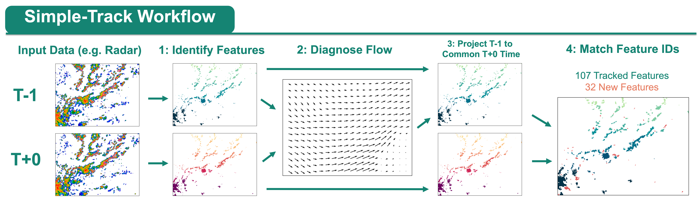
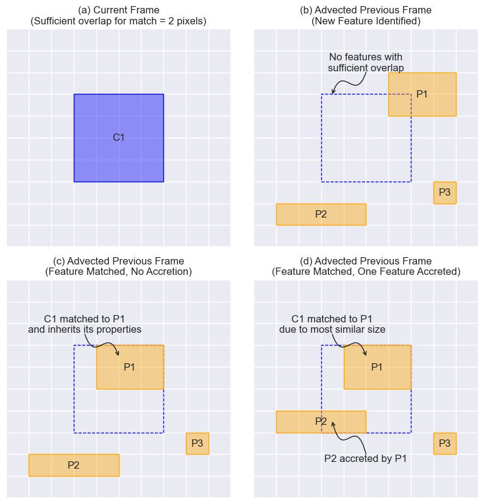
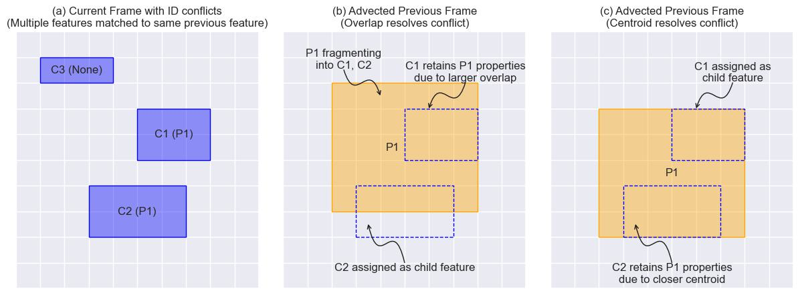

# Simple-Track Workflow

Once inputs have been loaded into Simple-Track, the code performs the following workflow. The process can be broken down into four main steps.

<p align="center">

</p>

## Step 1: Identify Features
First, features are identified in the input data based on the exceedance of a given threshold set by the user. Smaller thresholds will typically ensure features maintain better persistence between frames, but with the trade-off that the user may be less concerned with tracking less impactful features. 

Each contiguous region met by the threshold is labelled with a unique identifier using a floodfill algorithm. The connectivity structure between neighbouring pixels can be chosen by the user but is set to eight-way connectivity by default (i.e., all cardinal and diagonal pixels surrounding a given pixel are connected by the same label). This procedure is called using [`scipy.ndimage.label`](https://docs.scipy.org/doc/scipy/reference/generated/scipy.ndimage.label.html). Feature labelling occurs in each input field independently, and it is therefore unlikely that the same feature in different fields will be assigned the same label at this stage. The purpose of the next three steps is therefore to identify matching features between the two frames and enforce label consistency. 

All fields and data valid at a given time are stored in a `Frame` object and added to a `Timeline` object for easy access. After the feature field is created, a new `Feature` object is created for each unique label in the feature field. The list of properties contained in each `Feature` is described in [the timeline docs](timeline.md). 

### Config Options
```yaml
FEATURE:
  threshold: 1 
  under_threshold: false 
  min_size: 4
```
threshold (float, required):
* Sets the minimum threshold for defining a feature using > condition

under_threshold (bool, optional):
* Defaults to `False`
* If set to `True`, features are instead identified as being below the given threshold using < condition

min_size (int, optional):
* Defaults to `4`
* Sets the minimum size of a contiguous region of data that will be tracked using the code

### Relevant Simple-Track Methods

```python 
Frame.identify_features(threshold, under_threshold, min_size)
```

## Step 2a: Diagnose Flow Field (FlowSolver)

<p align="center">

</p>

Once features have been identified, the next step is to estimate the flow field that would, in theory, translate the features from the previous frame to the current frame. This field is estimated by partitioning the domain into overlapping subdomains and calculating a constant dx, dy for each of these subdomains. These displacements are calculated using a standard phase correlation method that is [common in image registration](https://ieeexplore.ieee.org/document/4043437). The above figure shows a schematic for performing this phase correlation: firstly, both images are transformed to Fourier space. The cross-power spectrum is then calculated from these transformed images to assess spatial similarity. When this power spectrum is transformed back to real space, the index of maximum power indicates the best estimate of the pixel displacement between the two inputs. In Simple-Track, this procedure is called using [`skimage.registration.phase_cross_correlation`](https://scikit-image.org/docs/stable/api/skimage.registration.html). Phase correlation is performed for all overlapping subdomains and interpolated to the full grid by 2D cubic interpolation using [`scipy.interpolate.RectBivariateSpline`](https://docs.scipy.org/doc/scipy/reference/generated/scipy.interpolate.RectBivariateSpline.html) with bivariate spline values `kx=3, ky=3`. 

Additionally, before displacements are calculated, input images are filtered using a tukey window which tapers values towards zero at the edges of each subdomain. A tukey window is a combination of a cosine and Hanning window that provides a good balance between preventing spectral leakage and maintaining good frequency resolution. This 2D filter is calculated using [`scipy.signal.windows.tukey`](https://docs.scipy.org/doc/scipy/reference/generated/scipy.signal.windows.tukey.html) for each dimension separately and then combined using an outer product to yield the 2D filter. 

<p align="center">

</p>

An example of the flow field obtained by this process is shown above. Note in particular that it is only possible to estimate the flow over regions where features are present, hence there are sparse regions in the top left and bottom right of the domain. The main parameter for step 2 is the number (or size) of sub-domains. The size of sub-domain should reflect the largest region over which storm displacement can be considered uniform. This will vary with user case. In an effort to simplify the input options, this parameter will default to the domain shape divided by five if not set by the user. This default is a reasonable starting point for many cases but may need to be adjusted by the user if the flow field exhibits large temporal or spatial variability. 


### Config Options

```yaml
FLOW_SOLVER:
  overlap_threshold: 0.3
  subdomain_size: 100 
  min_fractional_coverage: 0.01  
  subdomain_tolerance: 3.0  
  apply_tukey_filtering: True 
```
overlap_threshold (float, optional):
* Defaults to `0.3`
* Sets the minimum fraction of overlap expected from features in each subdomain for a displacement to be calculated

subdomain_size (int, optional):
* Size of the subdomain over which to calculate displacement
* Should be large enough that multiple features can be contained within each subdomain, but not so large that it is unresponsive to local changes 
* If not set in the config, the code will estimate as being the input domain shape / 5

min_fractional_coverage (float, optional):
* Defaults to `0.1`
* Minimum fractional cover of objects required for fft to obtain (dy, dx) displacement. If coverage is below this value, code will return 0 displacement

subdomain_tolerance (float, optional):
* Defaults to `3.0`
* Sets the maximum difference in displacement values between adjacent subdomains (to remove spurious values).
* If any subdomain displacements differ by more than this amount, they are set to 0

apply_tukey_filtering (bool, optional):
* Defaults to `True`
* If enabled, applies a smooth filter to each subdomain to minimise spectral leakage during phase cross-correlation.


### Relevant Simple-Track Methods

```python 
y_flow, x_flow = FlowSolver.analyse_flow(prev_frame, current_frame)
```

## Step 2b: Diagnose Flow Field (DISFlowSolver)
Rather than using the built-in Simple-Track Solver, users may instead wish to use existing optical flow algorithms. Here, we have implemented one such solver, the [Dense Inverse Search (DIS)](https://arxiv.org/abs/1603.03590) optical flow scheme [from the opencv repository](https://opencv-opencv.mintlify.app/api/video/optical-flow#disopticalflow).

As with the built-in FlowSolver, the estimated flow fields are dependent on a subdomain size. However, rather than being used to estimate the flow within the subdomain, a given subdomains is matched to the closest corresponding subdomain in the next frame from within a given search window. The displacement is then estimated as the vector that translates matched subdomains.

Compared to the built-in flow solver, which can only estimate flow over regions containing feature, The DIS scheme can more effectively fill in the expected flow field in regions without features. This is because it uses patch aggregation across multiple scales, and so the flow-field from lower resolution searches can be used to fill in gaps in the domain. This also has the benefit of being less sensitive to small or inconsistent features, and therefore produces flow fields that are more consistent between frames. This scheme is also slightly quicker than the built=in method.

However, it is worth noting a limitation of this scheme: since it is designed specifically to solve computer vision problems, it will only accept unsigned 8-bit integer arrays as input (i.e., arrays containing integers between 0 and 255). Since Simple-Track largely works with feature fields, where feature labels will easily exceed 255, a different strategy must be taken. Instead, the feature field is converted to a binary field and this is used for tracking. Tests comparing this to feature field inputs found this also produced accurate outputs, and is therefore implemented here. 

There is also a function which will normalise any input field to be convertible to the desired `np.uint8` type, so users can try estimating flow fields with raw fields as well if so desired. However, in our tests, this was found to be less accurate than using feature or binary fields as input. 

For tracking purposes, both schemes produce good estimates of the flow in the regions that are important for the artificial frame advection step. Sensitivity tests between the two schemes have showed that the largest differences in the flow field occur over regions that do not contain features, and therefore will not impact the tracking.

### Note: Optional Dependency
Using `DISFlowSolver` requires the `opencv-python` package to be installed, but this is not included by default in the Simple-Track environment. Instead, this may be installed using one of the following commands:
```
pip install opencv-python
conda install conda-forge::opencv
```


### Config Options
```yaml
DIS_FLOW_SOLVER:
  subdomain_size: default
```

subdomain_size (int|str, optional):
* Size of the patch over which to calculate displacements.
* If set to "default", automatically calculates this as the minimum input domain shape / 5

### Relevant Simple-Track Methods

```python 
y_flow, x_flow = DISFlowSolver.analyse_flow(prev_frame, current_frame)
```

## Step 2c: Diagnose Flow Field (ILKFlowSolver)
ILKFlowSolver is another alternative to the built-in Simple-Track Solver. This scheme uses the `skimage.registration.optical_flow_ilk` scheme with some sensible parameters to estimate the flow. [See here for more information about ILK.](https://scikit-image.org/docs/stable/api/skimage.registration.html)

Since scikit-image is already required by Simple-Track, using this optical flow scheme does not require any additional dependencies and can therefore be used as is. However, in testing, this was found to be slightly slower and less accurate than the built in scheme.


## Step 3: Artificial Frame Advection
The next step is to use the derived flow field to artificially advect features in the previous frame to estimate their location at the time of the current frame. This pseudo-nowcasting process is an important step for accurately matching features between the two frames in a way which reduces the dependence on the time between frames. While this step could in theory be performed using an image morphing technique, a simpler solution is implemented here. Instead, the feature-average displacement is used to translate each feature in the "feature_field". In the case of multiple features ids attempting to occupy the same pixel, the id value that is closest to its feature centroid is chosen. Strictly, these features should merge if they come into contact, but this would be undesirable for the purposes of tracking features since the merged feature is then no longer present for matching.

### Config Options
None

### Relevant Simple-Track Methods
```python 
advected_frame = FrameTracker.advect_frame(frame, y_flow, x_flow)
```

## Step 4: Match Features

<p align="center">

</p>

With both frames now valid at the same effective timestep, features in the current frame can then be matched to features in the previous frame. A feature is considered matched if the fraction of overlap with a feature in the previous frame exceeds a certain threshold, set to 0.3 by default. If no features are matched, the comparison is repeated over an expanded circular neighbourhood surrounding the feature in the current frame (see [Handling Insufficient Overlaps](#handling-insufficient-overlaps)). Then, as depicted in Figure above, the following the procedures are performed based on the number of matched features:

* Panel (b): If no matched features are found in the previous frame, the feature in the new frame is considered to be a new feature which is given a new id not used by a feature in any previous frames.

* Panel (c): If a single matched feature is found in the previous frame, the feature in the current frame will inherit its id (and given to the `Feature.provisional_id` property) and will inherit and increment its lifetime.

* Panel (d): If multiple matched features are found:

    * The feature with the closest size is chosen as the matched feature to inherit its properties.
    * If this process finds multiple suitable candidate, the feature with the closest centroid is then chosen as the match.
    * If this still does not choose a single feature, then the feature with the smallest id is chosen.

    All other matched features that are not chosen as the primary feature are considered to be accreted by the current feature, and these ids are added to the `Feature.accreted` property of the current feature.


<p align="center">

</p>

As mentioned above, features in the current frame will only provisionally inherit an id during this process. This is because there may be multiple features that are given the same id after this process has completed. This is likely to happen if the feature in the previous frame is fragmenting and spawning other features in the current frame, as depicted in Figure above. The feature that retains the label is initially decided by the largest overlap with the respective feature in the previous field. If multiple features share the same overlap, then the feature with the closest centroid is chosen. All other features are given a fresh id, and their `Feature.parent`| properties are set to the retaining label. Similarly, the `Feature.child` property of the feature which retains its provisional id is set to the new ids of all of the child features.

At the end of this process, the features in the current frame will be consistent between frames for those features which have matched, any new features will have a fresh id not used by a feature in any previous frame, and any information about mergers or splits will be recorded by the feature. The data in this frame is now ready for output and for matching with the next frame in sequence. 

### Config Options
```yaml
TRACKING:
  overlap_nbhood: 5 
  overlap_threshold: 0.3
  retain_lifetime_on_split: True
```

overlap_nbhood (int, optional):
* Defaults to `5`
* If a Feature in the current frame is not matched to another in the previous Feature just using its own extent, the code search an additional circular radius around the centre of the feature.
* This value sets the size of the radius/nbhood to search
* To disable this extra searching entirely, set this value to `0`

overlap_threshold (float, optional):
* Defaults to `0.3`
* Sets the threshold required for a feature to count as being matched to another feature.
* If multiple features meet this threshold, additional logic is employed to determine which is the most accurate match. All other features are designated as parents or children, depending on the frame

retain_lifetime_on_split (bool, optional):
* Defaults to `True`
* Determines whether a feature that has split from a parent feature should retain the lifetime of its parent, or should be reset to 0

### Relevant Simple-Track Methods
```python 
FrameTracker.run(prev_frame, current_frame)
# Note, this also includes the artificial advection from Step 3
```
