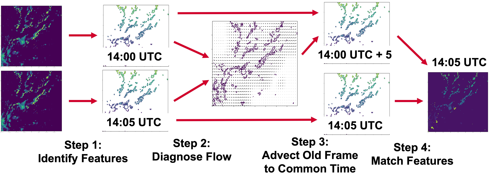
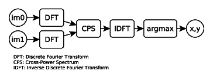
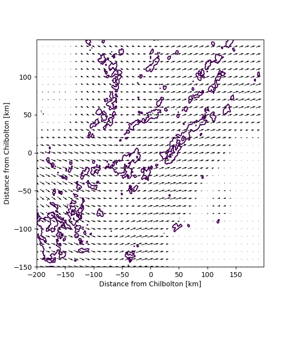

# Simple-Track Workflow

Once inputs have been loaded into Simple-Track, the code performs the following workflow. The process can be broken down into four main steps.

<p align="center">

</p>

## Step 1: Identify Features
First, features are identified in the input data based on the exceedance of a given threshold set by the user. Smaller thresholds will typically ensure features maintain better persistence between frames, but with the trade-off that the user may be less concerned with tracking less impactful features. 

Each contiguous region met by the threshold is labelled with a unique identifier using a floodfill algorithm. The connectivity structure between neighbouring pixels can be chosen by the user but is set to eight-way connectivity by default (i.e., all cardinal and diagonal pixels surrounding a given pixel are connected by the same label). This procedure is called using [`scipy.ndimage.label`](https://docs.scipy.org/doc/scipy/reference/generated/scipy.ndimage.label.html). Feature labelling occurs in each input field independently, and it is therefore unlikely that the same feature in different fields will be assigned the same label at this stage. The purpose of the next three steps is therefore to identify matching features between the two frames and enforce label consistency. 

All fields and data valid at a given time are stored in a `Frame` object and added to a `Timeline` object for easy access. After the feature field is created, a new `Feature` object is created for each unique label in the feature field. The list of properties contained in each `Feature` is described in [the timeline docs](timeline.md). 

### Config Options
```yaml
FEATURE:
  threshold: 1 
  under_threshold: false 
  min_size: 4
```
threshold (float, required):
* Sets the minimum threshold for defining a feature using > condition

under_threshold (bool, optional):
* Defaults to `False`
* If set to `True`, features are instead identified as being below the given threshold using < condition

min_size (int, optional):
* Defaults to `4`
* Sets the minimum size of a contiguous region of data that will be tracked using the code

### Relevant Simple-Track Methods

```python 
Frame.identify_features(threshold, under_threshold, min_size)
```

## Step 2: Diagnose Flow Field

<p align="center">

</p>

Once features have been identified, the next step is to estimate the flow field that would, in theory, translate the features from the previous frame to the current frame. This field is estimated by partitioning the domain into overlapping subdomains and calculating a constant dx, dy for each of these subdomains. These displacements are calculated using a standard phase correlation method that is [common in image registration](https://ieeexplore.ieee.org/document/4043437). The above figure shows a schematic for performing this phase correlation: firstly, both images are transformed to Fourier space. The cross-power spectrum is then calculated from these transformed images to assess spatial similarity. When this power spectrum is transformed back to real space, the index of maximum power indicates the best estimate of the pixel displacement between the two inputs. In Simple-Track, this procedure is called using [`skimage.registration.phase_cross_correlation`](https://scikit-image.org/docs/stable/api/skimage.registration.html). Phase correlation is performed for all overlapping subdomains and interpolated to the full grid by 2D cubic interpolation using [`scipy.interpolate.RectBivariateSpline`](https://docs.scipy.org/doc/scipy/reference/generated/scipy.interpolate.RectBivariateSpline.html) with bivariate spline values `kx=3, ky=3`. 

Additionally, before displacements are calculated, input images are filtered using a tukey window which tapers values towards zero at the edges of each subdomain. A tukey window is a combination of a cosine and Hanning window that provides a good balance between preventing spectral leakage and maintaining good frequency resolution. This 2D filter is calculated using [`scipy.signal.windows.tukey`](https://docs.scipy.org/doc/scipy/reference/generated/scipy.signal.windows.tukey.html) for each dimension separately and then combined using an outer product to yield the 2D filter. 

<p align="center">

</p>

An example of the flow field obtained by this process is shown above. Note in particular that it is only possible to estimate the flow over regions where features are present, hence there are sparse regions in the top left and bottom right of the domain. The main parameter for step 2 is the number (or size) of sub-domains. The size of sub-domain should reflect the largest region over which storm displacement can be considered uniform. This will vary with user case. In an effort to simplify the input options, this parameter will default to the domain shape divided by five if not set by the user. This default is a reasonable starting point for many cases but may need to be adjusted by the user if the flow field exhibits large temporal or spatial variability. 

<!-- TODO: in this section, list the config options that are important and describe their impact. Also list the main classes and methods that are used here.  -->

```yaml
FLOW_SOLVER:
  overlap_threshold: 0.3
  subdomain_size: 100 
  min_fractional_coverage: 0.01  
  subdomain_tolerance: 3.0  
  apply_tukey_filtering: True 
```
overlap_threshold (float, optional):
* Defaults to `0.3`
* Sets the minimum fraction of overlap expected from features in each subdomain for a displacement to be calculated

subdomain_size (int, optional):
* Size of the subdomain over which to calculate displacement
* Should be large enough that multiple features can be contained within each subdomain, but not so large that it is unresponsive to local changes 
* If not set in the config, the code will estimate as being the input domain shape / 5

min_fractional_coverage (float, optional):
* Defaults to `0.1`
* Minimum fractional cover of objects required for fft to obtain (dy, dx) displacement. If coverage is below this value, code will return 0 displacement

subdomain_tolerance (float, optional):
* Defaults to `3.0`
* Sets the maximum difference in displacement values between adjacent subdomains (to remove spurious values).
* If any subdomain displacements differ by more than this amount, they are set to 0

apply_tukey_filtering (bool, optional):
* Defaults to `True`
* If enabled, applies a smooth filter to each subdomain to minimise spectral leakage during phase cross-correlation.


```yaml
TRACKING:
  overlap_nbhood: 5 
  overlap_threshold: 0.3
  retain_lifetime_on_split: True
```

overlap_nbhood (int, optional):
* Defaults to `5`
* If a Feature in the current frame is not matched to another in the previous Feature just using its own extent, the code search an additional circular radius around the centre of the feature.
* This value sets the size of the radius/nbhood to search
* To disable this extra searching entirely, set this value to `0`

overlap_threshold (float, optional):
* Defaults to `0.3`
* Sets the threshold required for a feature to count as being matched to another feature.
* If multiple features meet this threshold, additional logic is employed to determine which is the most accurate match. All other features are designated as parents or children, depending on the frame

retain_lifetime_on_split (bool, optional):
* Defaults to `True`
* Determines whether a feature that has split from a parent feature should retain the lifetime of its parent, or should be reset to 0